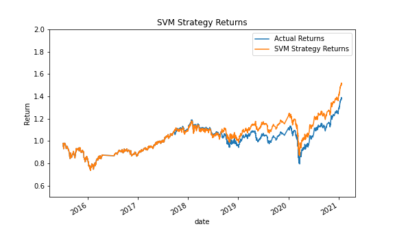
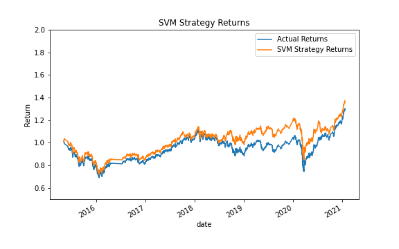
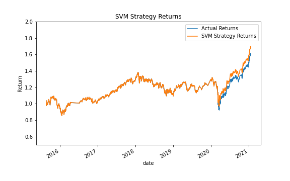
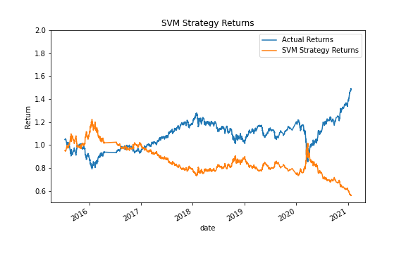
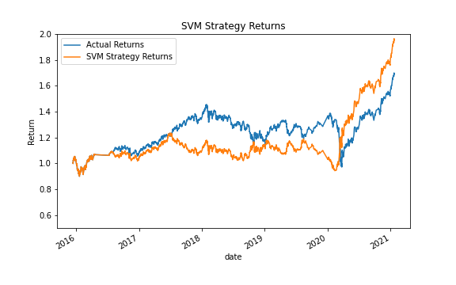
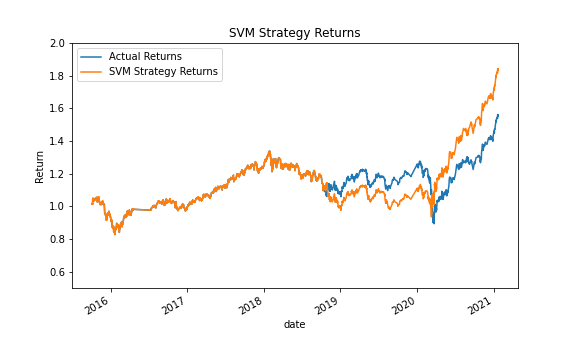
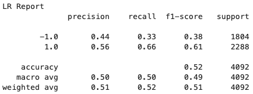
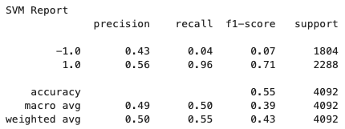
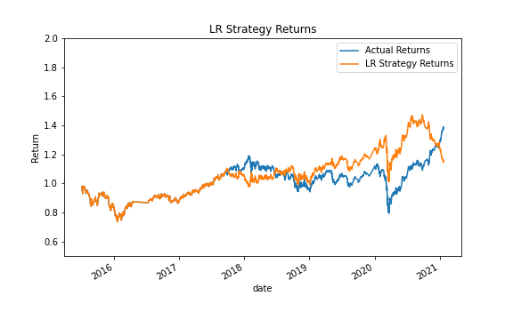
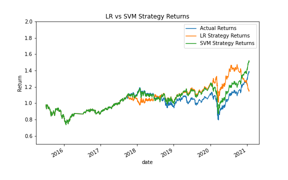

# Trading Signals - Predicting & Backtesting a Trading Algorithm

## Description

This is where I tell you about it  

---
## Tuning & Evaluating the Algorithm

The first step was to obtain a baseline performance of the SVM machine learning algorithm using:  
    - 3-Month Training Window  
    - 4-Day SMA  
    - 100-Day SMA  

### *Adjust parameters to seek performance*
After obtaining this initial baseline, I adjusted all three parameters to determine what inputs performed best. Variations that were tested include: 
    - Training Windows of 1 month, 3 months, & 6 months  
    - Short Window SMA of (days): 4, 5, 20, 30  
    - Long Windwo SMA of (days): 50, 100, 200  

For this initial model, I found that the 1 month training window yielded terrible results, nearly mirroring the asset's performance. In fact, the movement was so opposed to the actual performance that it might be worth looking into an alternate strategy where you performed the opposite trade as to what this algorithm says to do.  
The best performing strategy used a 6 month training window, with the signal being the 30 day SMA & the 200 day SMA. This combination massively outperformed all others, nearly doubling profits over the analysis period. See the following visualizations of the different combinations and their respective yields.

>**The followihng images show the differet combinations of signal frequency and training window durations:**
>
>  
>`Top Left: 3M Train, SMA 4/100 (Baseline)`  
>`Top Right: 1M Train, SMA 4/100 (Short train window)`  
>
>  
>`Middle Left: 6M Train, SMA 5/50 (Nearly identitical until end, then outperforms)`  
>`Middle Right: 1M Train, SMA 30/200 (Nearly opposite actual returns of longer, better perfoming 6M version)`  
>
>  
>`Bottom Left: 6M Train, SMA 30/200 (BEST PERFORMANCE)`  
>`Bottom Right: 6M Train, SMA 4/100 (Second Best Performance by training longer)`  

### *Incorporate a different Machine Learning Model*
For this next step, I deployed a Logistic Regression Model to see if it would model the data better and lead to better performance. The Baseline Training Window of 3 Months was used along with the original signal of SMA 4/SMA 100.  

The following images show the results for comparison between the Actual Returns, the SVM model, and the LR model.  

>
>  
>`Left: LR Model Classification Report`  
>`Right: SVM Model Classification Report`  

>
>  
>`Left: Actual vs LR Returns`  
>`Right: Actual vs LR vs SVM Returns` 

As we can see from these classification reports, the LR model is approximately as precise in both taking action on a market signal. However, the SVM model has a higher recall for the `Buy` signals, which means the upside isn't missed out on when the market makes those strong upward moves. Of course, the SVM misses essentially all the `Sell` signals, as evidenced by a recall of 0.04. So, although you capture much more upside movement, you don't get to sit out the downside.  

Interestingly, when comparing the visualizations for these two different strategies, we can se that both the SVM & the LR models were performing similarly until the large decline in 2020. During that time, the LR model's ability higher recall for the `Sell` signal appears to have allowed for minimization of that downward movement. From that point through the end of the year, the LR model massively outperformed until around the beginning of 2021, it began losing capital and has shown no signs of recovering.  

### *Summary*

When comparing SVM & LR for optimal returns, the SVM model appears to continue outperforming the LR model when using a 3 month training window paired with the Fast SMA Signal of 4 days and the Slow SMA Signal of 100 days. This may not be the case if using different durtion SMAs or training windows, which would be an excellent area to explore for futher Alpha. It would also be worth testing additional Machine Learning technologies since it clearly has the ability to make a big impact on the long term profitability of an algorithm.

---
## Technologies

### Core Requirements
- Python 3.8
- Jupyter Notebook

### Dependencies
- Pandas
- Numpy
- pathlib
- hvplot
- matplotlib
- sklearn

---
## Contributors

Base pseudocode/code was provided by UW & Trilogy. ZrowGz/Eamon created the code to create functionality.